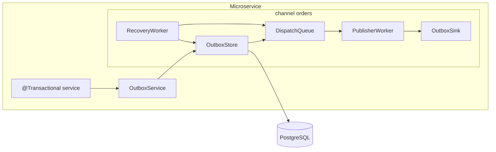

# spring-boot-outbox-starter

[](https://github.com/KHolodilin/spring-boot-outbox-starter/actions/workflows/ci.yml)
[](LICENSE)

Transactional Outbox Spring Boot starter for Java 21 / Spring Boot 4.1 with **multi-channel** pipelines, PostgreSQL as source of truth, and memory or Redis wake-up queues.

## Modules

| Module | Description |
|--------|-------------|
| `outbox-core` | Model, SPI, fluent API, channel registry, publisher/recovery workers |
| `outbox-persistence-jdbc` | JDBC `OutboxStore`, partitioned DDL, schema create/validate |
| `outbox-queue-memory` | In-process dispatch queue (default) |
| `outbox-queue-redis` | Shared Redis wake-up queue (fail-open) |
| `spring-boot-outbox-starter` | Auto-configuration, Micrometer, health |
| `outbox-demo-kafka` | Single-channel demo → Kafka |
| `outbox-demo-rest` | Dual-channel demo (`payments` + `webhooks`) |

## Architecture



Each **channel** is an isolated pipeline: `table → queue → publisher worker → OutboxSink`.  
If `outbox.channels` is empty, an implicit channel `default` (table `outbox_events`) is used.

## Quick start

```xml
<dependency>
  <groupId>com.kholodilin</groupId>
  <artifactId>spring-boot-outbox-starter</artifactId>
  <version>0.1.0-SNAPSHOT</version>
</dependency>
```

```java
@Component
public class KafkaOrdersSink implements OutboxSink {
    @Override
    public OutboxPublishResult publish(List<OutboxRecord> batch) {
        // deliver batch; do not update outbox tables
        return new OutboxPublishResult.AllSucceeded();
    }
}
```

```java
@Transactional
public void createOrder(Order order) {
    // business writes...
    outboxService
            .eventType("ORDER_CREATED")
            .aggregateId(String.valueOf(order.id()))
            .partitionKey(order.customerId())
            .payload(order)
            .append();
}
```

## Fluent API (multi-channel)

```java
outboxService
    .channel("orders")
    .eventType("ORDER_CREATED")
    .aggregateId(String.valueOf(orderId))
    .partitionKey(customerId)
    .payload(payload)
    .append();

outboxService
    .channel("notifications")
    .eventType("ORDER_EMAIL_REQUESTED")
    .aggregateId(String.valueOf(orderId))
    .partitionKey(customerId)
    .payload(emailPayload)
    .append();
```

Bind sinks with `@OutboxChannelSink("orders")`. A single unqualified `OutboxSink` bean maps to channel `default`.

## Configuration

```yaml
outbox:
  enabled: true
  instance-id: ${HOSTNAME:local}
  defaults:
    persistence:
      schema:
        mode: create          # create | validate | none
    queue:
      type: memory            # memory | redis | auto
      capacity: 10000
    publisher:
      enabled: true
      lease-duration: 30s
      max-retries: 5
    recovery:
      enabled: true
      interval: 10s
      batch-size: 500
  channels:
    orders:
      persistence:
        table-name: outbox_events_orders
    notifications:
      persistence:
        table-name: outbox_events_notifications
      queue:
        type: redis
```

## Schema

Table-per-channel, partitioned by `status` (ACTIVE `< 100`, ARCHIVE `≥ 100`). Canonical DDL: `outbox-persistence-jdbc` resource `outbox-schema.sql`.

## Metrics & health

Event-level metrics carry tags `channel` and `eventType`:

- `outbox_enqueue_total`, `outbox_dequeue_total`
- `outbox_publish_total{result}`, `outbox_publish_seconds`
- `outbox_recovery_total`
- gauges `outbox_queue_size{channel}`, `outbox_queue_pressure{channel}`

Health indicator name: `outbox` (per-channel pressure / publisher enabled).

## Demo apps

- **outbox-demo-kafka** — default channel → Kafka topic `payments.events`
- **outbox-demo-rest** — `payments` (stub sink) + `webhooks` (REST) isolation

## Relationship to idempotency-starter

Outbox does **not** include HTTP idempotency. Compose with [`spring-boot-idempotency-starter`](https://github.com/KHolodilin/spring-boot-idempotency-starter) inside the same `@Transactional` boundary when needed.

## License

Apache License 2.0
