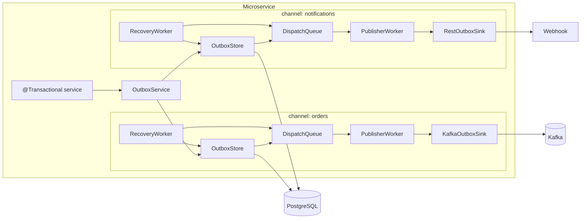
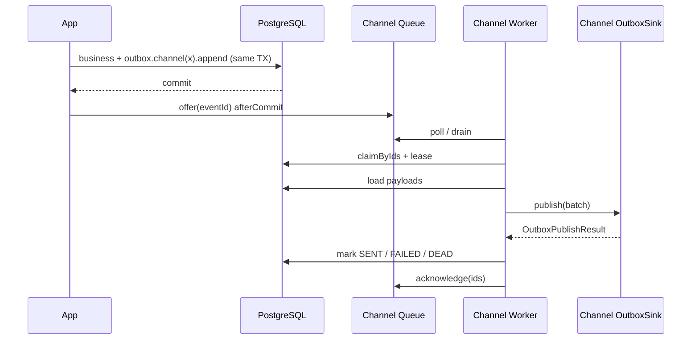
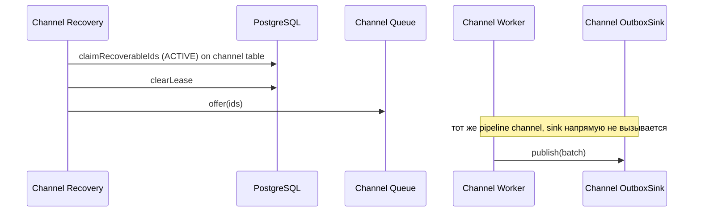

# Техническое задание: `spring-boot-outbox-starter`

**Версия документа:** 1.2  
**Статус:** Draft  
**Целевой репозиторий:** [отдельный] `https://github.com/KHolodilin/spring-boot-outbox-starter`  
**Стек:** Java 21, Spring Boot 4.1, Maven, PostgreSQL  
**Связанные проекты:**
- [`spring-boot-idempotency-starter`](https://github.com/KHolodilin/spring-boot-idempotency-starter) — отдельно; не входит в scope outbox
- [`spring-transactional-outbox-kafka`](https://github.com/KHolodilin/spring-transactional-outbox-kafka) — reference / будущий consumer стартера

**Changelog 1.1:** multi-channel first-class (несколько независимых outbox pipeline в одном МС), table-per-channel, `@OutboxChannelSink`, обновлены API / config / demos / tests.  
**Changelog 1.2:** observability — tag `eventType` на event-level метриках (кроме queue gauges).

---

## 1. Цель

Выпустить переиспользуемый Spring Boot starter для **Transactional Outbox** с поддержкой **нескольких каналов (channels)** в одном микросервисе:

1. Запись outbox-события в **той же DB-транзакции**, что и бизнес-изменения (в store выбранного channel).
2. После commit — постановка `eventId` в **dispatch queue этого channel** (memory / Redis).
3. Фоновый worker **на каждый channel**: claim/lease → batch load → вызов **`OutboxSink` channel** → `SENT` / `FAILED` / `DEAD`.
4. Recovery worker **на каждый channel**: только re-enqueue unpublished ACTIVE rows в очередь того же channel (единый pipeline внутри channel).

**Channel** = именованный изолированный pipeline:

```text
channel → table → dispatch queue → publisher worker → OutboxSink
```

В одном МС можно собрать несколько outbox (например `orders` → Kafka, `notifications` → REST) с разным backpressure, retry и lease.

Если `outbox.channels` не задан — работает один implicit channel `default` (простой DX).

**Не цель стартера:** идемпотентность HTTP-запросов, доменная state machine, Modulith EPR, конкретный брокер как обязательная зависимость.

---

## 2. Нефункциональные требования

| ID | Требование |
|----|------------|
| NFR-1 | Java 21+, Spring Boot 4.1.x |
| NFR-2 | PostgreSQL как source of truth для outbox rows |
| NFR-3 | At-least-once delivery; идемпотентность на стороне consumer/sink target |
| NFR-4 | Multi-instance safe claim через `FOR UPDATE SKIP LOCKED` + lease |
| NFR-5 | Line coverage ≥ 85% (JaCoCo) |
| NFR-6 | Spotless (Palantir), enforcer, Javadoc на public API |
| NFR-7 | Публикация: GitHub Packages + Maven Central (профиль `release`) |
| NFR-8 | README и публичные примеры — **на английском** (как idempotency-starter) |
| NFR-9 | Apache License 2.0 |
| NFR-10 | Несколько channel в одном приложении: изоляция queue/worker/sink/table |

---

## 3. Название и координаты артефактов

| | Значение |
|---|---|
| GitHub repo | `spring-boot-outbox-starter` |
| Parent GAV | `com.kholodilin:spring-boot-outbox-starter-parent` |
| Starter artifact | `com.kholodilin:spring-boot-outbox-starter` |
| First version | `0.1.0-SNAPSHOT` in POMs; README / Maven Central use `0.1.0` on release |

---

## 4. Модули

```
spring-boot-outbox-starter-parent
├── outbox-core
├── outbox-persistence-jdbc
├── outbox-queue-memory
├── outbox-queue-redis                 # optional
├── outbox-spring-boot-starter         # artifactId: spring-boot-outbox-starter
├── outbox-demo-kafka
└── outbox-demo-rest
```

| Module | Назначение |
|--------|------------|
| `outbox-core` | Модель, SPI, fluent API, `OutboxChannel` / registry, pipeline-логика workers |
| `outbox-persistence-jdbc` | `OutboxStore` на JDBC/PostgreSQL, DDL template per table, schema create/validate |
| `outbox-queue-memory` | Default `OutboxDispatchQueue` (per-process, per-channel instance) |
| `outbox-queue-redis` | Shared wake-up queue (fail-open), отдельный key-prefix на channel |
| `spring-boot-outbox-starter` | Auto-configuration, channels properties, Micrometer, health |
| `outbox-demo-kafka` | Demo: 1 channel `default` + Kafka `OutboxSink` |
| `outbox-demo-rest` | Demo: **2 channels** (`payments` + `webhooks`) — Kafka/stub + REST |

**Явно отсутствует в v1:** `outbox-sink-kafka` как обязательный модуль стартера.  
Kafka/REST sink живут в **демо / приложении**.

---

## 5. Архитектура

### 5.1. Multi-channel схема



### 5.2. Normal flow (внутри одного channel)



### 5.3. Recovery flow (внутри одного channel)



### 5.4. Границы ответственности

| Компонент | Владелец | Ответственность |
|-----------|----------|-----------------|
| `OutboxService` | starter | fluent API; резолв channel; append + afterCommit |
| `OutboxChannel` / `OutboxChannelRegistry` | starter | именованные pipeline |
| `OutboxStore` | starter (jdbc) | CRUD/claim/status/lease **на table channel** |
| `OutboxDispatchQueue` | starter (queue modules) | wake-up coalesce + backpressure **на channel** |
| `OutboxSink` | **приложение / demo** | доставка batch; binding на channel |
| Idempotency | **отдельный стартер** | не часть outbox |
| Domain payload mapping | приложение | opaque JSON в `payload` |

### 5.5. Инварианты

1. PostgreSQL — единственный source of truth для outbox rows.
2. Dispatch queue — best-effort; `offer=false` допустим; recovery обязателен.
3. Recovery **никогда** не вызывает `OutboxSink` напрямую.
4. Статусы ACTIVE (`< 100`) / ARCHIVE (`≥ 100`) с partition pruning для recovery.
5. `OutboxSink` не меняет статусы в БД — только starter после `publish`.
6. At-least-once: sink/target идемпотентен по `eventId` (или эквиваленту).
7. Channels изолированы: очередь/worker/recovery/sink одного channel не обслуживают другой.
8. v1 persistence: **table-per-channel** (не shared table + колонка `channel`).
9. Неизвестный channel в `.channel("...")` → fail-fast при `append()` (или earlier).
10. Несколько `eventType` в одном channel — норма; очередь хранит только `eventId`, тип читается из БД.

---

## 6. Channels (first-class)

### 6.1. Модель

```java
public interface OutboxChannel {
    String name();
    OutboxStore store();
    OutboxDispatchQueue queue();
    OutboxSink sink();                 // required if publisher.enabled
    OutboxChannelProperties properties();
}

public interface OutboxChannelRegistry {
    OutboxChannel getRequired(String name);
    Optional<OutboxChannel> find(String name);
    Collection<OutboxChannel> all();
}
```

На каждый сконфигурированный channel starter создаёт:

- 1 × `OutboxStore` (свой `table-name`);
- 1 × `OutboxDispatchQueue`;
- 1 × `PublisherWorker` (свой поток), если publisher enabled и sink найден;
- 1 × `RecoveryWorker` (свой interval / общий scheduler с per-channel tick).

### 6.2. Default channel

- Если `outbox.channels` **пуст / не задан** → registry содержит один channel `default`.
- `outboxService.eventType(...)` эквивалентен `outboxService.channel("default").eventType(...)`.
- Table по умолчанию: `outbox_events`.

### 6.3. Когда заводить второй channel

| Ситуация | Решение |
|----------|---------|
| Много `eventType`, один транспорт | один channel |
| Разные sink (Kafka + REST) / разный backpressure | **отдельные channels** |
| Нужна изоляция потоков (медленный HTTP не тормозит Kafka) | **отдельные channels** |

---

## 7. Публичный API

### 7.1. Fluent API (обязательный стиль)

Стиль — как у `IdempotencyService`:

```java
idempotencyService
    .operation("CREATE_PAYMENT")
    .key(key)
    .request(request)
    .ttl(Duration.ofDays(30)) // optional
    .execute(PaymentResult.class, () -> { ... });
```

Outbox (single channel / default):

```java
outboxService
    .eventType("ORDER_CREATED")
    .aggregateId(String.valueOf(orderId))
    .partitionKey(String.valueOf(customerId))
    .payload(payloadJson)
    .header("correlationId", corrId)      // optional
    .traceParent(traceParent)             // optional
    .append();                            // returns eventId (long)
```

Outbox (explicit channel):

```java
outboxService
    .channel("orders")
    .eventType("ORDER_CREATED")
    .aggregateId(String.valueOf(orderId))
    .partitionKey(String.valueOf(customerId))
    .payload(orderPayload)
    .append();

outboxService
    .channel("notifications")
    .eventType("ORDER_EMAIL_REQUESTED")
    .aggregateId(String.valueOf(orderId))
    .partitionKey(String.valueOf(customerId))
    .payload(emailPayload)
    .append();
```

Оба `append()` могут быть в **одной** бизнес-транзакции; после commit — `offer` в **две разные** очереди.

#### Контракт

```java
public interface OutboxService {
    /** Selects channel; unknown name fails on append (or immediately). */
    OutboxAppend channel(String channel);

    /** Shorthand for channel("default").eventType(eventType). */
    OutboxAppend eventType(String eventType);
}

public interface OutboxAppend {
    OutboxAppend eventType(String eventType);
    OutboxAppend aggregateId(String aggregateId);
    OutboxAppend partitionKey(String partitionKey);
    OutboxAppend payload(String json);
    OutboxAppend payload(Object value);           // Jackson serialize → jsonb
    OutboxAppend header(String name, String value);
    OutboxAppend headers(Map<String, String> headers);
    OutboxAppend traceParent(String traceParent);

    /** Inserts NEW row in the current TX and registers afterCommit enqueue on the channel queue. */
    long append();
}
```

#### Правила

- `append()` только внутри активной DB-транзакции (как idempotency → `MissingTransactionException`).
- До `append()` обязательны: `eventType`, `aggregateId`, `partitionKey`, `payload`.
- `partitionKey` для sink (Kafka key и т.п.); starter домен не интерпретирует.
- После commit: `channel.queue().offer(eventId)`.

#### Композиция с idempotency-starter

```java
@Transactional
public ExecutionResult<PaymentResult> createPayment(String key, CreatePaymentRequest request) {
    return idempotencyService
            .operation("CREATE_PAYMENT")
            .key(key)
            .request(request)
            .ttl(Duration.ofDays(30))
            .execute(PaymentResult.class, () -> {
                long paymentId = paymentRepository.insert(...);

                outboxService
                        .channel("payments")
                        .eventType("PAYMENT_CREATED")
                        .aggregateId(String.valueOf(paymentId))
                        .partitionKey(request.customerId())
                        .payload(Map.of("paymentId", paymentId, "amount", request.amount()))
                        .append();

                outboxService
                        .channel("webhooks")
                        .eventType("PAYMENT_WEBHOOK")
                        .aggregateId(String.valueOf(paymentId))
                        .partitionKey(request.customerId())
                        .payload(Map.of("paymentId", paymentId))
                        .append();

                return ExecutionResult.success(new PaymentResult(paymentId));
            });
}
```

### 7.2. `OutboxSink` (вне стартера, per channel)

```java
public interface OutboxSink {
    OutboxPublishResult publish(List<OutboxRecord> batch);
}
```

```java
public sealed interface OutboxPublishResult {
    record AllSucceeded() implements OutboxPublishResult {}
    record AllFailed(Throwable cause) implements OutboxPublishResult {}
    // v1.1+: record Partial(Map<Long, ItemOutcome> byEventId) ...
}
```

```java
public record OutboxRecord(
        String channel,
        long eventId,
        String eventType,
        String aggregateId,
        String partitionKey,
        String payloadJson,
        Map<String, String> headers,
        String traceParent,
        int retryCount,
        Instant createdAt
) {}
```

#### Binding sink → channel

```java
@Component
@OutboxChannelSink("orders")
public class KafkaOrdersSink implements OutboxSink { ... }

@Component
@OutboxChannelSink("notifications")
public class RestNotificationsSink implements OutboxSink { ... }
```

Правила auto-config:

1. Для каждого channel с `publisher.enabled=true` обязателен ровно один sink (`@OutboxChannelSink("name")` или единственный `OutboxSink` bean → только для `default`).
2. Нет sink → **fail-fast** при старте с именем channel.
3. Один класс может быть зарегистрирован на несколько channel только явно (две аннотации / два bean alias) — не рекомендуется по умолчанию.
4. `publisher.enabled=false` на channel — write-only (append + store), worker не стартует.

#### Требования к sink

1. Не обновлять таблицы outbox самостоятельно.
2. Допускать повтор для того же `eventId`.
3. Ошибка → throw или `AllFailed`.
4. Уважать таймауты относительно `lease-duration` channel.

Маршрутизация по `eventType` **внутри** одного sink — ответственность приложения (очередь типа не знает).

---

## 8. SPI очереди

```java
public interface OutboxDispatchQueue {
    boolean offer(long eventId);
    Long poll(Duration timeout) throws InterruptedException;
    List<Long> drain(int max);
    void acknowledge(Collection<Long> eventIds);
    int size();
    int capacity();
    double pressure();
}
```

| Реализация | Module | Семантика |
|------------|--------|-----------|
| Memory | `outbox-queue-memory` | per-process, **отдельный instance на channel** |
| Redis | `outbox-queue-redis` | shared wake-up, fail-open, **отдельный key-prefix на channel** |

Семантика: coalesce / dedup / in-flight; `offer=false` при dup / in-flight / backpressure; SoT — PostgreSQL.

Очередь **не** несёт `eventType` — только `eventId`.

---

## 9. Persistence / schema

### 9.1. Table-per-channel (v1)

Каждый channel → своя таблица (изоляция индексов, vacuum, claim):

```text
outbox_events                 # channel default
outbox_events_orders          # channel orders
outbox_events_notifications   # channel notifications
```

Shared table + колонка `channel` — **out of scope v1** (можно позже).

### 9.2. DDL template (generic, без order_*)

```sql
CREATE TABLE <table_name> (
    id              BIGINT GENERATED BY DEFAULT AS IDENTITY,
    aggregate_id    VARCHAR(128)  NOT NULL,
    partition_key   VARCHAR(128)  NOT NULL,
    event_type      VARCHAR(128)  NOT NULL,
    payload         JSONB         NOT NULL,
    headers         JSONB,
    status          INT           NOT NULL,
    retry_count     INT           NOT NULL DEFAULT 0,
    locked_by       VARCHAR(128),
    locked_until    TIMESTAMPTZ,
    trace_parent    TEXT,
    sent_at         TIMESTAMPTZ,
    created_at      TIMESTAMPTZ   NOT NULL DEFAULT NOW(),
    PRIMARY KEY (status, id)
) PARTITION BY RANGE (status);

-- ACTIVE:  status IN [0, 100)
-- ARCHIVE: status IN [100, MAXVALUE)
```

Статусы: `NEW=0`, `PROCESSING=1`, `FAILED=2`, `DEAD=101`, `SENT=110`.

`OutboxStore` параметризуется `tableName` (и при необходимости schema).

### 9.3. Schema mode

```yaml
outbox:
  defaults:
    persistence:
      schema:
        mode: validate    # create | validate | none
```

Per-channel override допускается. Canonical DDL — ресурс в `outbox-persistence-jdbc`.

---

## 10. Configuration

```yaml
outbox:
  enabled: true
  instance-id: ${HOSTNAME:local}

  # defaults merged into each channel
  defaults:
    persistence:
      schema:
        mode: validate          # create | validate | none
    queue:
      type: memory              # memory | redis | auto
      capacity: 10000
      batch-size: 250
      batch-wait: 50ms
      usage-threshold: 0.8
      redis:
        key-prefix: "outbox:"   # channel name appended / overridden per channel
        # failure-policy: fail-open
    publisher:
      enabled: true
      lease-duration: 30s
      max-retries: 5
    recovery:
      enabled: true
      interval: 10s
      batch-size: 500

  # empty → single implicit channel "default", table outbox_events
  channels:
    orders:
      persistence:
        table-name: outbox_events_orders
      queue:
        type: memory
        capacity: 20000

    notifications:
      persistence:
        table-name: outbox_events_notifications
      queue:
        type: redis
        redis:
          key-prefix: "outbox:notifications:"
      publisher:
        max-retries: 10
        lease-duration: 60s
      recovery:
        interval: 15s
```

Backward-friendly shorthand (только `default`): допускается плоский стиль без `channels`, мапящийся на `defaults` + channel `default` — если это упрощает README; в коде properties предпочтительно всегда через channel model.

---

## 11. Auto-configuration

При наличии `DataSource`:

1. Собрать `OutboxChannelRegistry` из `outbox.channels` (или implicit `default`).
2. Для каждого channel: store + queue + schema validate/create.
3. Забиндить `OutboxSink` по `@OutboxChannelSink` / fallback для `default`.
4. Поднять per-channel `PublisherWorker` / `RecoveryWorker` согласно flags.
5. Зарегистрировать `OutboxService`.
6. Micrometer + health с tags/details `channel` (+ `eventType` на event-level метриках).

Kafka / WebClient **не** зависимости `spring-boot-outbox-starter`.

---

## 12. Демо-приложения

### 12.1. `outbox-demo-kafka`

**Стек:** Postgres + Kafka.

**Сценарий:** один channel `default` → `KafkaOutboxSink` → topic `payments.events`.

**Проверяет:** simple DX, normal/recovery flow, claim.

### 12.2. `outbox-demo-rest` (multi-channel)

**Стек:** Postgres + WireMock (+ опционально Kafka Testcontainers).

**Сценарий — два channel в одном app:**

| Channel | Table | Sink |
|---------|-------|------|
| `payments` | `outbox_events_payments` | Kafka или in-memory stub publisher |
| `webhooks` | `outbox_events_webhooks` | `RestOutboxSink` → WireMock `/hooks/payments` |

Один `POST` создаёт business row и **два** `append()` в одной TX.

**Проверяет:**

- изоляция pipeline (ошибка REST не блокирует payments worker);
- binding `@OutboxChannelSink`;
- retry/DEAD на webhooks;
- события не попадают в чужую очередь/таблицу.

### 12.3. Общее

- Schema mode `create`.
- Actuator + метрики с tags `channel` / `eventType` (§15).
- Опционально композиция с `spring-boot-idempotency-starter`.

---

## 13. Тестирование

### 13.1. Уровни

| Уровень | Где | Что |
|---------|-----|-----|
| Unit | `outbox-core` | fluent API, channel resolve, workers helpers |
| Unit | queue modules | offer/dedup/in-flight/pressure/ack |
| Integration JDBC | `outbox-persistence-jdbc` | table-per-channel, claim, SKIP LOCKED, archive |
| Integration starter | starter | multi-channel auto-config, missing sink fail-fast, defaults merge |
| IT Kafka demo | `outbox-demo-kafka` | append → Kafka message |
| IT REST / multichannel demo | `outbox-demo-rest` | dual channel; REST stub; isolation |

### 13.2. Обязательные сценарии

1. Append без транзакции → ошибка.
2. Rollback → нет строк outbox / нет publish.
3. Commit → enqueue → sink → `SENT`.
4. Sink `AllFailed` → `FAILED` → recovery → retry.
5. Max retries → `DEAD`.
6. Queue full → `offer=false`, recovery подбирает.
7. Duplicate `offer` → false.
8. Multi-instance claim (`SKIP LOCKED`).
9. Нет sink для channel + publisher enabled → startup failure **с именем channel**.
10. Redis queue fail-open.
11. **Unknown channel** в `.channel("x")` → ошибка.
12. **Two channels:** два append в одной TX → строки в разных tables → разные sink вызваны; падение sink A не останавливает worker B.
13. `eventType` разные в одном channel → один worker, sink маршрутизирует сам.

### 13.3. Coverage

- JaCoCo line ≥ **0.85** на library modules.
- Demo: IT обязательны; `*Application` можно exclude.

---

## 14. README (требования к стилю)

Английский, структура как у idempotency-starter:

1. Badges  
2. Short pitch  
3. Modules table  
4. Architecture mermaid (**multi-channel**)  
5. Quick start  
6. Fluent API examples (`default` + `.channel(...)`)  
7. Implementing `OutboxSink` + `@OutboxChannelSink`  
8. Configuration (`defaults` + `channels`)  
9. Schema management / table-per-channel  
10. Dispatch queue (memory / redis per channel)  
11. Metrics & health (`channel`, `eventType` tags)  
12. Demo apps  
13. Relationship to idempotency-starter  
14. License  

Пример в README:

```java
outboxService
    .channel("orders")
    .eventType("ORDER_CREATED")
    .aggregateId(String.valueOf(orderId))
    .partitionKey(customerId)
    .payload(payload)
    .append();
```

---

## 15. Observability (v1)

Tags:

| Tag | Где | Примечание |
|-----|-----|------------|
| `channel` | все метрики + health details | имя pipeline |
| `eventType` | event-level counters/timers | значение из row / `OutboxRecord`; **не** на queue gauges |
| `result` | только `outbox_publish_total` | исход publish (`success` / `failure` / …) |

Метрики:

- `outbox_enqueue_total{channel,eventType}`
- `outbox_dequeue_total{channel,eventType}` — инкремент **после** load row (очередь знает только `eventId`)
- `outbox_publish_total{channel,eventType,result}`
- `outbox_publish_seconds{channel,eventType}`
- `outbox_recovery_total{channel,eventType}` — по фактическим re-enqueued ids (тип из БД при claim/load batch)
- gauges (без `eventType`): `outbox_queue_size{channel}`, `outbox_queue_pressure{channel}`

Health: aggregate `outbox` с details per channel (pressure, publisher enabled).

Tracing: optional hooks; колонка `trace_parent` + поле в `OutboxRecord`.

---

## 16. Out of scope (v1)

- Shared single table + колонка `channel`
- R2DBC / WebFlux worker
- Partial batch success API (v1.1+)
- Debezium / CDC
- Spring Modulith EPR integration
- Built-in distributed state machine / sagas
- Idempotency inside outbox starter
- Обязательный Kafka module в starter
- Dynamic channel registration at runtime (только config/startup)

---

## 17. План поставки

| Phase | Deliverable |
|-------|-------------|
| P0 | Repo skeleton, parent POM, CI, Spotless |
| P1 | `outbox-core`: model, SPI, fluent API, `OutboxChannel` / registry |
| P2 | `outbox-persistence-jdbc`: table-per-channel + Testcontainers IT |
| P3 | `outbox-queue-memory` + per-channel worker/recovery |
| P4 | Starter auto-config: defaults + channels + `@OutboxChannelSink` |
| P5 | `outbox-demo-kafka` (single channel) + IT |
| P6 | `outbox-demo-rest` (multi-channel) + IT |
| P7 | `outbox-queue-redis` per-channel prefix + fail-open IT |
| P8 | README, Javadoc, coverage gate, `0.1.0` |
| P9 | Integrate into `spring-transactional-outbox-kafka` — отдельная задача |

---

## 18. Критерии приёмки

1. Репозиторий собирается в CI.  
2. Single-channel (`default`) + один `OutboxSink` — E2E работает.  
3. Multi-channel: ≥2 channel в одном app, разные tables/queues/sinks, изоляция подтверждена IT.  
4. Fluent API:

   ```java
   outboxService
       .channel("orders")
       .eventType("...")
       .aggregateId("...")
       .partitionKey("...")
       .payload(...)
       .append();
   ```

5. Демо Kafka и REST (multi-channel) документированы и поднимаются.  
6. Сценарии §13.2; JaCoCo ≥ 85% на library modules.  
7. README на английском по §14.  
8. Нет hard-dependency на Kafka/WebClient в starter.  
9. Idempotency не встроен; есть пример композиции.  
10. Unknown channel и missing sink → понятный fail-fast.

---

## 19. Риски и решения

| Риск | Митигация |
|------|-----------|
| Путаница outbox vs job queue vs Modulith | README: границы; sink = delivery only |
| Redis как SoT | Инвариант; fail-open + recovery |
| Partial batch | v1 all-or-nothing |
| Смешение медленного и быстрого sink | multi-channel изоляция |
| Domain-coupled schema | generic columns + table-per-channel |
| Слишком сложный DX для одного outbox | implicit `default` channel без `channels` map |
| Дублирование с order-service | миграция reference app после 0.1.0 |

---

## 20. Глоссарий

| Термин | Значение |
|--------|----------|
| Channel | Именованный изолированный outbox pipeline |
| Outbox row | Durable запись намерения доставить событие |
| Dispatch queue | Wake-up канал `eventId` внутри channel (не SoT) |
| Sink | Пользовательская доставка batch (`OutboxSink`), bound к channel |
| Claim / lease | Захват ACTIVE row под publisher instance |
| Recovery | Re-enqueue unpublished ids в queue **того же** channel |
| Table-per-channel | Отдельная Postgres-таблица на каждый channel (v1) |
